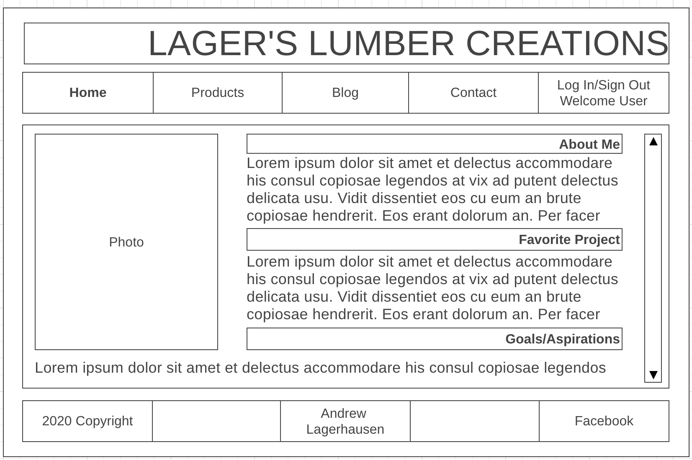
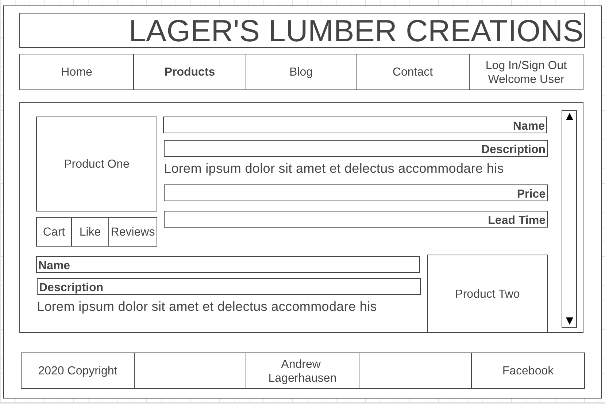
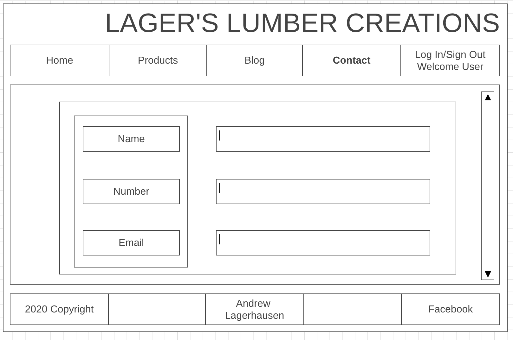
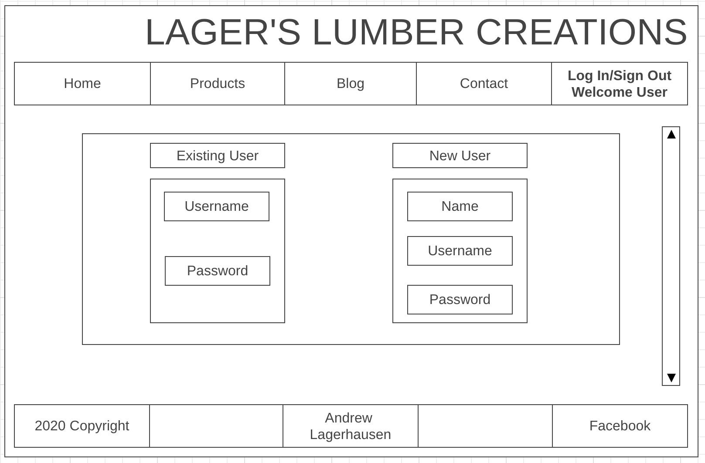

# Project 4 Capstone Project

## Project Description
This capstone project is going to be an E-Commerce website. I have a small side gig of doing woodworking, and when starting this web-dev class I thought it would be incredibly cool to build my very own website for it. 

## MVP
* Create a React-App for my E-Commerce Woodworking site.
* Create Links/Routes to navigate my webpage.
    * Have a products view page
    * Link to submit questions/comments
* Create auth (for login features)
* Create a shopping cart feature
    * Allow logged in users to add items to their cart.
    * Upon 'Checkout' allow users to submit their 'order' to my email & send the user a confirmation email.
* Add a syling library
* Add a backend database
    * Auth/Login
    * Products
    * Individuals shopping carts

## Stretch Goals
* Add a backend database
    * Add reviews for products
    * Add reviews for the creator
* Have a submit questions button that will send an email to myself.
## ERD

## Wireframes
Homepage

## User Stories
Who are your users?
* People who are looking for wood home decor/yard games.
What do my users what?
* To have their creative decor/game ideas brought to fruition.

1. As a user I would like to be able to search what products have been made before.
2. As a user I would like to be able to see reviews about each product that has been made before.
3. 
4. 
5. 
6. 
7. 
8. 
9. 
10. As a user I would like to be able to select items I would like created and submitted to the create.

## Code Snippets

## Technologies Used
1. VS Code
2. React App

## Installation Instructions 

## Issues/Unsolved Problems

## Final Thoughts

 Thank you for taking the time to read from/use my capstone project. This was an incredible test of my skills gain over the last 12 weeks.