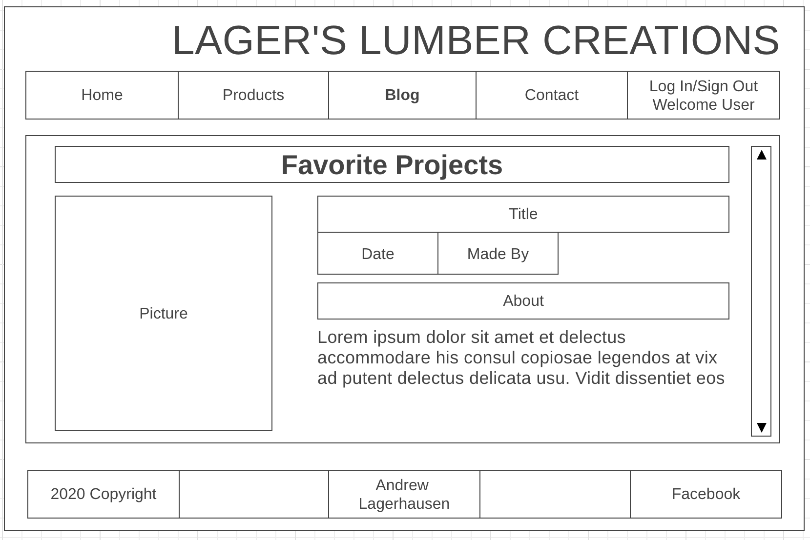

# Project 4 Capstone Project

## Project Description
This capstone project is going to be an E-Commerce website. I have a small side gig of doing woodworking, and when starting this web-dev class I thought it would be incredibly cool to build my very own website for it. 

Click here to see the finished product!
https://lagers_lumber_creations.surge.sh/

## MVP
* Create a React-App for my E-Commerce Woodworking site. **Done**
* Create Links/Routes to navigate my webpage. **Done**
    * Have a products view page **Done**
    * Link to submit questions/comments **Done**
* Create auth (for login features) **Done**
* Create a shopping cart feature **Done**
    * Allow logged in users to add items to their cart. **Done**
    * Upon 'Checkout' allow users to submit their 'order' to my email & send the user a confirmation email.
* Add a syling library **Done**
    * Evergreen UI...? **Done**
* Add a backend database **Done**
    * Auth/Login **Done**
    * Products **Done**
    * Individuals shopping carts
* Have a file uploader on the contact sheet for people to upload designs they would like to see if I could make **Done**

## Stretch Goals
* Add a backend database
    * Add reviews for products
    * Add reviews for the creator
    * Add the ability to keep track of stock... **Done-ish**
* Have a submit questions button that will send an email to myself. **Done**
* Add a Like button that allows users to upvote a product.

## ERD
**ERD**

## Wireframes
**Homepage**

**Products**

**Blog**

**Contact**

**Login**

## User Stories
Who are your users?
* People who are looking for wood home decor/yard games.
What do my users what?
* To have their creative decor/game ideas brought to fruition.

1. As a user I would like to be able to search what products have been made before.
2. As a user I would like to be able to see reviews about each product that has been made before.
3. As a user I would like to be able to see reviews about the woodworker.
4. As a user I would like to be able to contact the woodworker and ask further questions about style/price/new projects.
5. As a user I would like to know if a product is in stock or out of stock.
6. As a user I would like to see what have been the woodworkers favorite building pieces.
7. As a user I would like to be able to see what's in my shopping cart before submitting.
8. As a user I would like to be able to edit my shopping cart before submitting.
9. As a user I would like to be able to select items I would like created and submitted to the woodworker.
10. As a user I would like to visit a pleseant and appealing website with simple navigation.

## Code Snippets

## Technologies Used
1. VS Code
    1. Javascript
    2. HTML
    3. CSS
2. React App
3. Email JS
4. Everygreen UI

## Installation Instructions 

You will need to clone the github Frontend repo down to your local.
You will need to clone the github Backend repo down to your local.
You will need to install axious to have access to my backend.
You will need to install Everygreen UI.

## Final Thoughts

 Thank you for taking the time to read from/use my capstone project. This was an incredible test of my skills gain over the last 12 weeks.

 I was able to get where I am at in this capstone project with the help of the instructors and classmates. I also referenced some labs/homework when I wasn't quite remembering how to do something. 